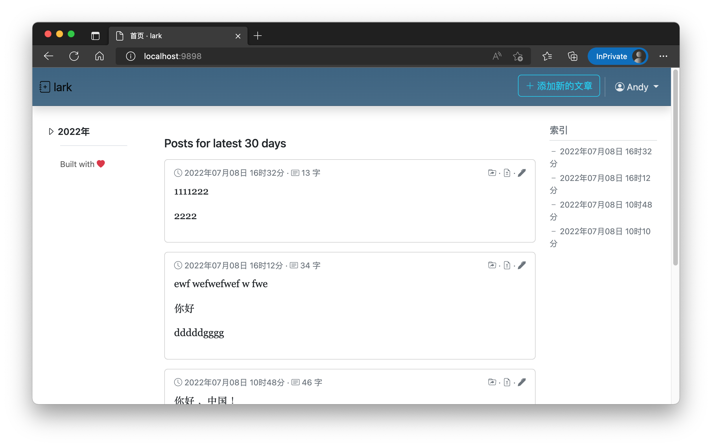
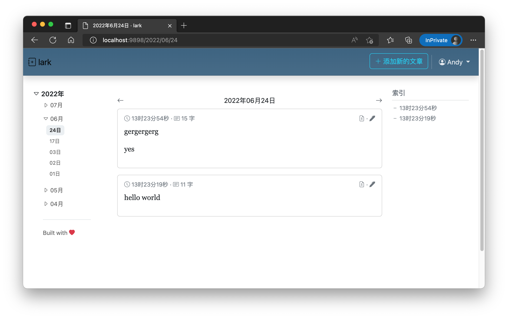

# lark
Your private self-hosted diary platform, keep your words as secret.

## Screenshots





## Installation

### Binary

Go to [latest release](https://github.com/JerryBian/lark/releases/tag/latest), download binary according to your target machine.

### Docker

Every release has a published docker image, go to [Docker Hub](https://hub.docker.com/r/cnbian/lark) or [GitHub Packge](https://github.com/JerryBian/lark/pkgs/container/lark) to check more details.

```
docker pull cnbian/lark:latest
```

```
docker pull ghcr.io/jerrybian/lark:latest
```

### Build source

This codebase relies on latest Golang(as of now go1.8.3) and NPM.

```
npm install
go build
```

That's all.

## Usage

Most configurations have default value applied if nothing provided, however the SQLite database location is stongly recommended to setup.

Listed all supported configurations below.

| Enviornment Variable | Default Value | Comment |
| --- | --- | --- |
| `ENV_DB_LOCATION` | `./_/_db` | Where SQLite stores at, recommend to setup |
| `ENV_SERVER_PORT` | `9898` | Server port |
| `ENV_SERVER_GIN_MODE` | `debug` | `GIN` runtime mode: `debug` or `release` |
| `ENV_SERVER_SESSION_SECRET` | `dev` | Authentication session key |
| `ENV_SERVER_MAX_WORDS_ALLOWED` | `320` | Maximum words allowed to publish |
| `ENV_USER_NAME` | `test` | User name |
| `ENV_USER_PASSWORD` | `test` | User password |
| `ENV_AZ_CONNSTR` |  | Azure storage connection string |
| `ENV_AZ_BLOB_CONTAINER` | `dev` | Azure storage container name |
| `ENV_AZ_BLOB` | `db.json` | Azure storage blob name |
| `ENV_AZ_BACKUP_INTERVAL` | `1` | Azure backup interval in minutes |


## License

GPL-3.0